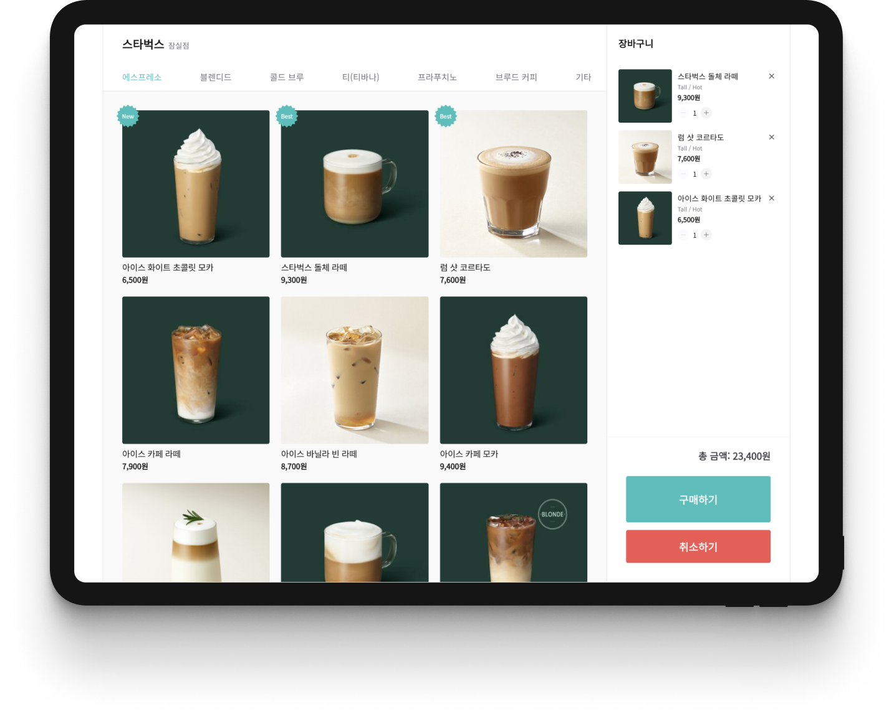
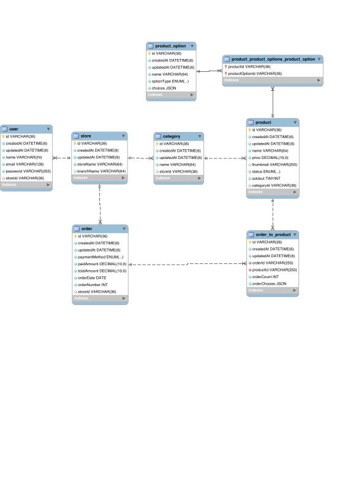

# 우아한 키오스크 (5-6주차 프로젝트, 이상림)



## 데모

- [데모 페이지](http://13.125.29.4/)

- [API 문서](http://13.125.29.4/docs)

## 프로젝트 구조

### ER 다이어그램(ERD)



## 배포

### Clone repository

```bash
git clone https://github.com/woowa-techcamp-2022/web-kiosk-sangrimlee.git
```

### Install dependency

```bash
yarn
```

### Set Environment Variables

**Client**

Production모드에서 필요

```
REACT_APP_API_URL="/api"
```

**Server**

```
PORT="PORT"
DATABASE_HOST="DATABASE_HOST"
DATABASE_PORT="DATABASE_PORT"
DATABASE_USERNAME="DATABASE_USERNAME"
DATABASE_PASSWORD="DATABASE_PASSWORD"
DATABASE_NAME="DATABASE_NAME"
JWT_SECRET_KEY="SECRET_KEY"
JWT_EXPIRES_IN="7d"
COOKIE_OPTIONS_HTTP_ONLY="true"
COOKIE_OPTIONS_SECURE="false"
```

### Development

**Client**

```bash
yarn client:dev
```

**Server**

```bash
yarn server:dev
```

### Production

**Build**

```bash
yarn build
```

**Start**

```bash
yarn start
```
