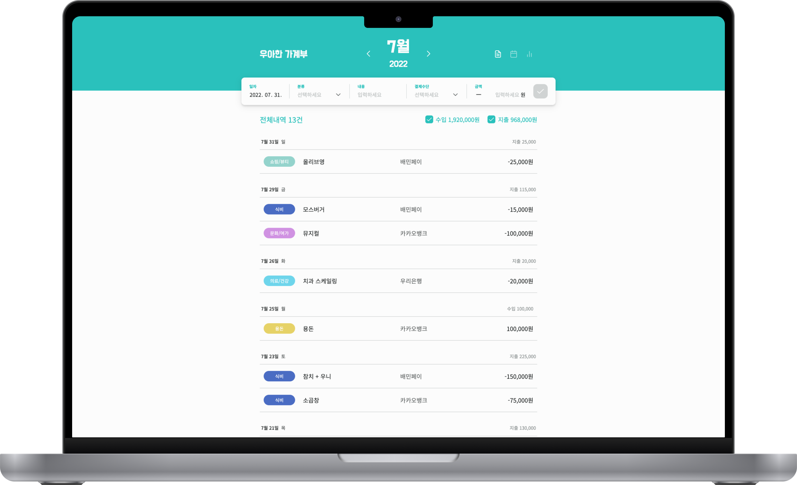
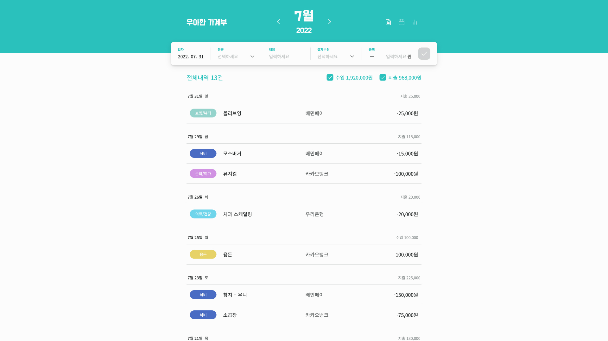
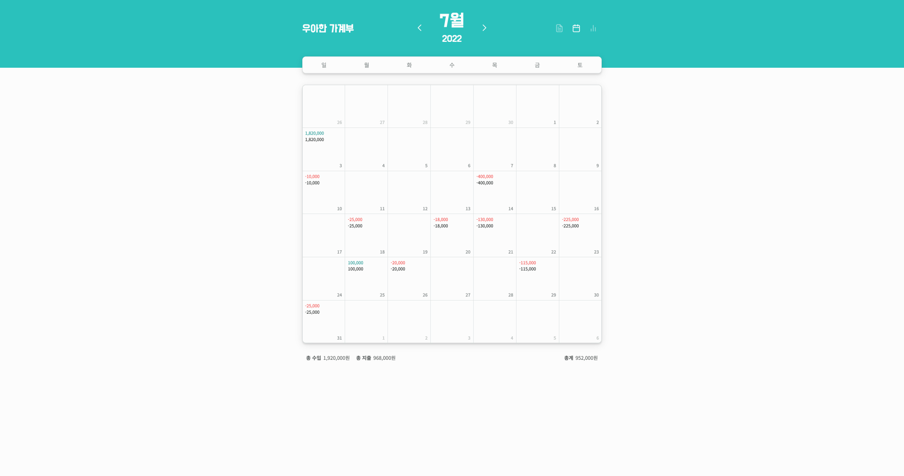
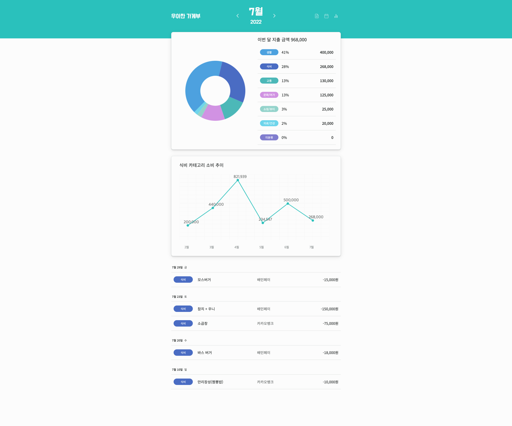

# 우아한 가계부 (3-4주차 프로젝트, 2팀)

<br>



<br>

## 🙋‍♂️ Members

안녕하세요👋

우아한 가계부 2팀 **상태관리**입니다.

<table>
  <tbody>
    <tr>
      <td align="center">
        <a href="https://github.com/sangrimlee">
          <br />
          <sub><b>이상림</b><br></sub>
        </a>
      </td>
      <td align="center">
        <a href="https://github.com/happyGyu">
          <br />
          <sub><b>황태규</b><br></sub>
        </a>
      </td>
    </tr>
  </tbody>
</table>

<br>

## 😎 Results

### 1. Demo

- [데모 보러 가기](http://3.34.193.200:3000/)

### 2. Presentation

- [발표 영상](https://youtu.be/WP2WCj1P970)

- [발표 자료](https://drive.google.com/file/d/1nKfg-4y-6Td6YJCuSvnpEfhiRQLQ-7zr/view?usp=sharing)

### 3. Screen Shot

<details>
 <summary>모두 보기</summary>
 






</details>

<br>

## 🖥 Start

### 1. Clone and install package

```bash
git clone https://github.com/woowa-techcamp-2022/web-moneybook-2.git

npm install
```

### 2. Set environment variables

```bash
# ./server/.env

PORT=
DB_HOST=
DB_NAME=
DB_USER=
DB_PASSWORD=
```

### 3. Build and run app

```bash
# production
npm run start:prod

# development
npm run dev
```
